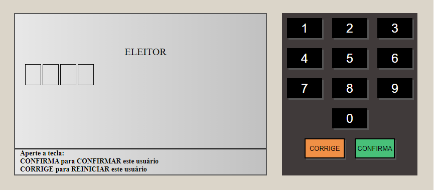
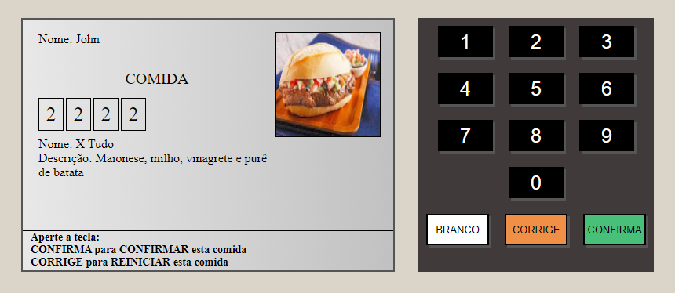
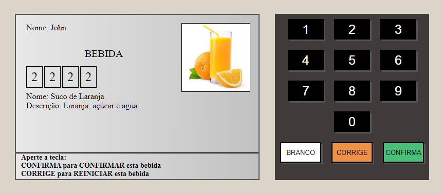
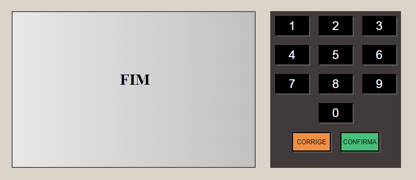
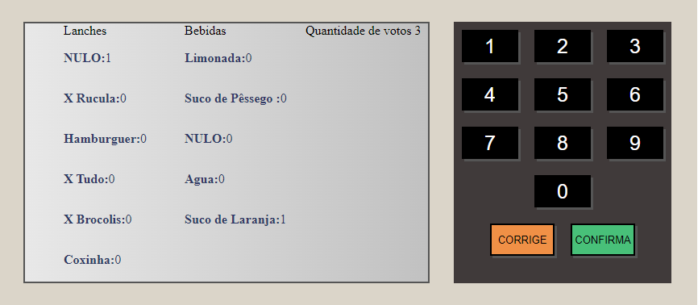

<h1 align="center">
    
</h1>

<br>

<p align="center">
  <a href="./LICENSE">
  
  </a>
  
  
  
  
  
</p>


<br>


<br>

## 🎥 Showcase

<p align="center">
  
  
  
  
  
</p>

<br>

## ⚙ Technologies

This project was developed using the following technologies:


[](https://sass-lang.com/)

[](https://nextjs.org/)

[](https://reactjs.org)

[](https://www.jest.oi/)

[](https://styled-components.com/)

[](https://www.typescriptlang.org/)

[](https://www.typescriptlang.org/)


  


<br>


## 🚀 Getting started


Follow the steps below 📝
```bash
# Install the dependencies
$ yarn

# Start the project
$ yarn dev
```

The app will be available for access on your browser at http://localhost:3000

## 📱 Contact

Contact me by email or LinkedIn:

<a href="mailto:gabriel.augusto99@hotmail.com"></a>

<a href="https://www.linkedin.com/in/gabriel-augusto-soler-stresser-366719100/"></a>

## 📝 License

This project is licensed under the MIT License. See the [LICENSE](LICENSE.md) file for details.


---

<p align="center">Made with 💜 by Gabriel Stresser</p>